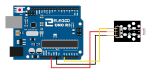

# 20 -- Mòdul LDR (foto resistència)

## Objectiu

En aquest exemple, aquest mòdul llegirà el valor de la resistència i
l'imprimirà en el monitor serial. Aquests valors poden reflectir la
intensitat de la llum ambiental.

## Material

|                               Imatge                               | Descripció                      |
| :----------------------------------------------------------------: | :------------------------------ |
|   | Arduino Uno o equivalent.       |
|  | Cables de connexió              |
|  | Mòdul fotorresistència (KY-018) |

## Descripció

La resistència dependent de la llum, també anomenada fotoresistència,
són dispositius sensibles a la llum que s'utilitzen amb major
freqüència per a indicar la presència o absència de llum, o per a
mesurar la intensitat de la llum.

## Especificacions

- Voltatge de funcionament: 3,3 - 5 V
- Tipus de eixida: Analògica
- Dimensions: 28 x 15 mm
- Pes: 2 g

## Configuració de pin

| Identificació | Pin                                                               |
| :-----------: | ----------------------------------------------------------------- |
|       S       | Pin d'eixida analògica, senyal de voltatge d'eixida en temps real |
|       +       | + 5V                                                              |
|       -       | GND                                                               |

## Muntatge



## Programació

```Arduino
/*
* Projecte nº: ARD020
* Data: 01.11.2021
* Descripcio: Modul LDR - fotoresistencia
* Nota:
*
*/

int sensorPin = A0; // defineix l'entrada per a la fotoresistència
int ledPin = 13; // defineix el pin led
int sensorValue = 0; // variable per a guardar el valor del sensor

void setup()
{
  pinMode(ledPin, OUTPUT);
  Serial.begin(9600);
}

void loop()
{
  sensorValue = analogRead(sensorPin);
  digitalWrite(ledPin, HIGH);
  delay(sensorValue);
  digitalWrite(ledPin, LOW);
  delay(sensorValue);
  Serial.println(sensorValue, DEC);
}
```

## Veure també

- [Index](../Index.md)
- [README](../README.md)
