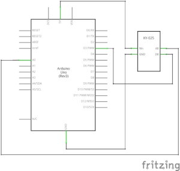

# 22 - Mòdul d'interruptor magnètic

## Material

|                               Imatge                               | Descripció                          |
| :----------------------------------------------------------------: | :---------------------------------- |
|   | Arduino Uno o equivalent.           |
|  | Cables de connexió                  |
|  | Mòdul interruptor magnètic (KY-025) |

## Descripció

L'interruptor magnètic és una espècie de component electrònic passiu de
commutació amb contactes amb una estructura simple, mida xicoteta i
fàcil de controlar. Consisteix en un sobre de vidre segellat on hi ha
dues llengüetes elàstiques ferroses i està ple d'un gas inert anomenat
rodi.

Normalment, les dues llengüetes estan separades en el sobre. Quan una
substància magnètica s'acosta a l'embolcall de vidre, les llengüetes
s'uniran a causa del camp magnètic completant així un circuit elèctric.
Quan el camp magnètic extern desapareix, dues llengüetes se separaran a
causa de la seua elasticitat, el circuit també es desconnecta.

Per tant, com a dispositiu de commutació de circuits controlat per
senyals de camp magnètic, l'interruptor de làmines també es pot
utilitzar com a sensor per a comptar i limitar, etc. (aplicat en els
sistemes de seguretat, utilitzat principalment per a la producció
d'imants de portes i finestres), i és també àmpliament utilitzat en una
varietat de dispositius de comunicació. En la pràctica, és comuna
utilitzar els dos imants permanents per a controlar la connexió de dues
làmines de metall, per la qual cosa també es denomina "magnetró".

## Especificacions

- Voltatge d'operació: 5 V
- Pin d'eixida digital i analògica
- Sensibilitat ajustable
- Grandària: 42,5 x 15 mm
- Pes: 2.964g

## Configuració de pins


Aquest interruptor de llengüeta ofereix una interfície analògica i
digital. El pin "G" connectat a GND, el pin "+" a 5 Vcc, el pin
"AO" ofereix l'eixida analògica mentre que el "DO" ofereix
l'eixida digital. S'utilitza un potenciòmetre com a resistència de
pull-up.

## Funcionament

Encara que un interruptor magnètic es pot activar col·locant-lo dins
d'una bobina elèctrica, molts interruptors i sensors magnètics
s'utilitzen per a la detecció de proximitat i s'activen mitjançant un
imant. Quan l'imant s'acosta al sensor/interruptor, el dispositiu
s'activa. A mesura que l'imant es retira de la proximitat del sensor/interruptor, el dispositiu es desactiva. No obstant això, la interacció
magnètica involucrada en l'activació dels contactes de l'interruptor
no és necessàriament òbvia. Una manera de pensar en la interacció és que
l'imant indueix pols magnètics en les parts metàl·liques de
l'interruptor i l'atracció resultant entre els contactes elèctrics fa
que s'active.


Una altra forma igualment vàlida de pensar sobre la interacció entre un
imant i un interruptor magnètic és que l'imant indueix un flux magnètic
a través dels contactes elèctrics. Quan el flux magnètic és prou alt,
l'atracció magnètica entre els contactes fa que l'interruptor es
tanque.


## Camp d'acció


Com pot veure's, l'orientació magnètica i la ubicació respecte a
l'interruptor magnètic juguen un paper important en les distàncies
d'activació. A més, la grandària de les regions activades (lòbuls)
variarà segons la força de l'imant i la sensibilitat de l'interruptor.
L'orientació adequada de l'imant respecte al sensor/interruptor
magnètic és una consideració important per a complir amb els requisits
de l'aplicació en tot el rang de tolerància per als sistemes mecànics,
la força magnètica i el sensor de làmines o la sensibilitat de
l'interruptor.

## Connexió




## Programació

Aquest primer codi llig el valor analògic del mòdul mitjançant una
entrada analògica del arduino, presenta el valor llegit pel monitor
serie i fa parpellejar el led de la placa segons el valor obtingut.

```Arduino
/*
* Projecte nº: ARD022a
* Data: 11.11.2021
* Descripcio: Modul interruptor magnetic
* Nota:
*
*/

int sensorPin = A0; // defineix la entrada analogica del sensor
int ledPin = 13; // eixida led per veure l'activacio
int sensorValue = 0; // variable per guardar el valor del sensor

void setup()
{
    pinMode(ledPin,OUTPUT);
    Serial.begin(9600);
}

void loop()
{
    sensorValue = analogRead(sensorPin);
    digitalWrite(ledPin, HIGH);
    delay(sensorValue);
    digitalWrite(ledPin, LOW);
    delay(sensorValue);
    Serial.println(sensorValue, DEC);
}
```

El següent codi activa el led de la placa quan el sensor envia senyal
alta per la eixida digital del mòdul.

```Arduino
/*
* Projecte nº: ARD022b
* Data: 11.11.2021
* Descripcio: Modul interruptor magnetic
* Nota:
*
*/

int Led=13; //defineix el port LED
int buttonpin=3; //defineix el port de l'interruptor
int val; //defineix la variable digital val

void setup()
{
    pinMode(Led,OUTPUT);//defineix LED com pin de eixida
    pinMode(buttonpin,INPUT);//defineix la entrada digital del interruptor
}

void loop()
{
    val=digitalRead(buttonpin);//asigna el valor de la entrada 3 a val
    if(val==HIGH)//quan el sensor envia señal, LED s'encen
    {
        digitalWrite(Led,HIGH);
    }
    else
    {
        digitalWrite(Led,LOW);
    }
}
```

## Veure també

- [Index](../Index.md)
- [README](../README.md)
