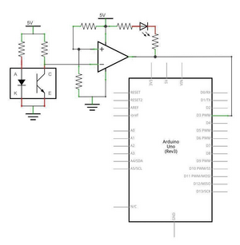
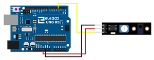

# 29 - Mòdul de seguiment de línies

## Descripció

Amb aquest mòdul, el vostre cotxe o robot només pot caminar per una
línia. Quan el detector es mou de blanc a negre, emet una senyal TTL,
Així que si dibuixes una línia negra entre les dues rodes del teu cotxe,
caminarà al llarg de la teva carretera esperada.


## Material

|                               Imatge                               | Descripció                            |
| :----------------------------------------------------------------: | :------------------------------------ |
|   | Arduino Uno o equivalent.             |
|  | Cables de connexió                    |
|  | Un mòdul de seguiment de línies KY023 |

## Principi de treball

El sensor d'infraroig TCRT5000 conté un díode emisor d'infrarojos que
continuament està emitint. Mentre no es reflexe cap raig IR o
l'intensitat reflectida siga baixa, el fototransistor es mantindrà en
tall i la eixida del mòdul estarà en ALT (HIGH). Quan un objecte entra
en el rang de detecció, o la superfície de reflexió canvia, la
intensitat dels raigs infrarojos reflectits és prou gran i el
fototransistor entra en saturació, per lo qual la sortida del mòdul
passa a nivell BAIX (LOW), i l'indicador LED s'il·lumina.



## Especificacions tècniques

- Alimentació: 3.3V to 5V
- Consum: 20mA @ 5V
- Rang de temperatura: 0°C \~ + 50°C
- Sortida: Negre - BAIX(LOW), Blanc - ALT(HIGH)
- Dimensions:48x10.5mm

## Configuració de pins

| Mòdul | Arduino  |
| :---: | :------: |
|   S   | Ent.dig. |
|  V+   |   +5V    |
|   G   |   GND    |

## Exemple

L'exemple mostra que quan el sensor detecta l'àrea negra, el senyal de
sortida del pin "S" és BAIX(LOW), llavors el LED13 s'apaga mentre la
llum "L" en aquest mòdul s'activa. Al contrari, LED13 s'activa.

La connexió a sota:



## Programació

```Arduino

int Led=13;
int tracking =3;
int val;

void setup()
{
  pinMode(Led,OUTPUT);
  pinMode(tracking,INPUT);
}

void loop()
{
val=digitalRead(tracking);
  if(val==HIGH){
    digitalWrite(Led,HIGH);
  }
  else{
    digitalWrite(Led,LOW);
  }
}

```

## Veure també

- [Index](../Index.md)
- [README](../README.md)
