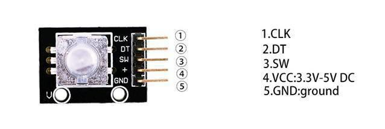
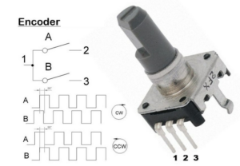
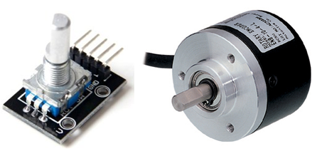
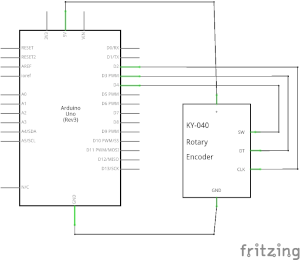
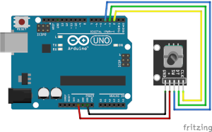

# 31 - Mòdul codificador rotatori

## Descripció general

El codificador rotatori és un dispositiu d'entrada rotatori que
proporciona una indicació de quant s'ha girat la perilla i en quina
direcció està girant.

És un gran dispositiu per al control de motors pas a pas i servo. També
pot usar-ho per a controlar dispositius com a potenciòmetres digitals.



## Material

|                               Imatge                               | Descripció                       |
| :----------------------------------------------------------------: | :------------------------------- |
|   | Arduino Uno o equivalent.        |
|  | Cables de connexió               |
|  | Mòdul codificador rotatori KY040 |

## Especificacions

- Voltatge de funcionament: 5V
- Angle mecànic: 360 graus
- Eixida: codi gris de 2 bits
- Posicions per revolució: 30

## Funcionament

### Mesurament de posició rotatòria

Un codificador rotatori o de "eix" és un dispositiu de mesurament
angular. S'utilitza per a mesurar amb precisió la rotació dels motors o
per a crear controladors de roda que poden girar infinitament (sense
topall final com ho té un potenciòmetre). Alguns d'ells també estan
equipats amb un botó polsador quan pressiones l'eix (com els que
s'usen per a la navegació en molts controladors de música). Venen en
tota mena de resolucions, des de potser 16 fins almenys 1024 passos per
revolució. Els codificadors industrials venen de 1200PPR a 10000PPR
(Pols per revolució).

### Principi de mesurament

Els codificadors rotatoris tenen dues o tres eixides A, B i Z. A i B
s'utilitzen per a determinar la direcció de rotació, i comptar el
nombre de polsos donarà la posició de rotació. Z està disponible en
codificadors de grau industrial. És pols de posició zero. Només dona un
pols en una revolució.

## Conceptes bàsics del codificador rotatori

Un codificador rotatori té un nombre fix de posicions per revolució
(PPR). El mòdul Keyes KY-040 té trenta d'aquestes posicions.

En un costat de l'interruptor hi ha tres pins. En el cas del KY-040,
estan orientats com es mostra.



Dins del codificador hi ha dos interruptors. Un interruptor connecta el
pin 1 al pin 2, i l'altre interruptor connecta el pin 1 al 3.

En cada posició del codificador, tots dos interruptors estan oberts o
tancats. Cada moviment angular fa que aquests interruptors canvien
d'estat de la següent manera:

- Si tots dos interruptors estan tancats, girar el codificador en
  sentit horari o antihorari una posició farà que tots dos
  interruptors s'òbriguen
- Si tots dos interruptors estan oberts, girar el codificador en
  sentit horari o antihorari una posició farà que tots dos
  interruptors es tanquen.

La següent il·lustració és representativa de com es construeix
l'interruptor.



La mesura del angle de rotació es calcula amb la següent formula:

$$Angle = \left(\frac{360}{ppr}\right)·polsos$$

L'eixida A està connectada a la interrupció (ASCENS) i quan ocorre la
interrupció, depenent de l'estat de l'eixida B, el comptatge de polsos
s'incrementa o disminueix.

Com podem veure, la posició angular de la terminal A i la terminal B és
tal que:

- Girar l'interruptor en el sentit de les agulles del rellotge farà
  que l'interruptor que connecta A i C canvie primer d'estat.
- Girar l'interruptor en sentit contrari a les agulles del rellotge
  farà que l'interruptor que connecta B i C canvie primer d'estat.

Si haguérem de representar l'obertura i el tancament dels interruptors
com a formes d'ona, es veuria així:


Hi ha molts codificadors disponibles en el mercat, tots tenen el
principi bàsic d'eixida A,B, com es mostra en la figura. Alguns dels
codificadors tenen GND, +V, SW, DT, CLK. La configuració de pins
d'aquests codificadors és:

- CLK = A
- DT = B
- SW = interruptor de pressió
- VCC = (+) 5V
- GND = (-)

El mòdul està dissenyat perquè l'eixida siga baixa quan els
interruptors estan tancats i alta quan els interruptors estan oberts.

El nivell baix es genera col·locant una connexió a terra en el pin C i
passant-la als pins CLK i DT quan els interruptors estan tancats.

El nivell alt es genera amb una entrada de subministrament de 5 V i
resistències pull-up, de manera que CLK i DT estan alts quan els
interruptors estan oberts.

No es va esmentar anteriorment l'existència d'un interruptor de botó
que és part integral del codificador. Si espenta l'eix, un interruptor
normalment obert es tancarà. La funció és útil si desitja canviar la
funció de l'interruptor. Per exemple, és possible que desitge tindre la
capacitat de realitzar ajustos gruixuts i fins.

## Connexió




## Programació

Codi: ARD031

```Arduino
/*
* Projecte nº: ARD031
* Data: 29/01/2022
* Descripcio: Prova del modul encoder KY040
* Nota:
*
*/

//Define the pin connection

int CLK = 2;//CLK->D2
int DT = 3;//DT->D3
int SW = 4;//SW->D4
const int interrupt0 = 0;
int count = 0;//Define the count
int lastCLK = 0;//CLK initial value

void setup()
{
    pinMode(SW, INPUT);
    digitalWrite(SW, HIGH);
    pinMode(CLK, INPUT);
    pinMode(DT, INPUT);
    attachInterrupt(interrupt0, ClockChanged, CHANGE);//Set the interrupt 0 handler, trigger level change
    Serial.begin(9600);
}

void loop()
{
    if (!digitalRead(SW) && count != 0) //Read the button press and the count value to 0 when the counter reset
    {
        count = 0;
        Serial.print("count:");
        Serial.println(count);
    }
}

//The interrupt handlers

void ClockChanged()
{
    int clkValue = digitalRead(CLK);//Read the CLK pin level
    int dtValue = digitalRead(DT);//Read the DT pin level
    if (lastCLK != clkValue)
    {
        lastCLK = clkValue;
        count += (clkValue != dtValue ? 1 : -1);//CLK and inconsistent DT, +1, otherwise -1
        Serial.print("count:");
        Serial.println(count);
    }
}
```

## Veure també

- [Index](../Index.md)
- [README](../README.md)
