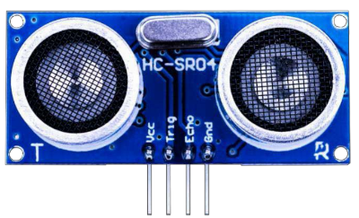
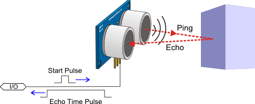
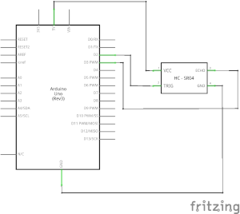
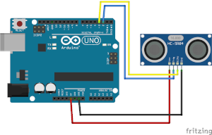

# 33 - Mòdul sensor ultrasònic

## Descripció general

El sensor ultrasònic és excel·lent per a tota mena de projectes que
necessiten mesuraments de distància, evitar obstacles per exemple.

L'HC-SR04 és econòmic i fàcil d'usar, ja que disposem d'una biblioteca
dissenyada específicament per a aquests sensors.



## Material

|                               Imatge                                | Descripció                |
| :-----------------------------------------------------------------: | :------------------------ |
|    | Arduino Uno o equivalent. |
|   | Cables de connexió        |
|  | Mòdul ultrasònic HC-SR04  |

## Introducció de components

### Sensor ultrasònic

Els sensors ultrasònics funcionen emetent ones de so amb una freqüència
que és massa alta perquè un humà les escolte. Aquestes ones sonores
viatgen per l'aire a la velocitat del so, aproximadament 343 m/s. Si hi
ha un objecte enfront del sensor, les ones sonores es reflecteixen i el
receptor del sensor ultrasònic les detecta. En mesurar quant temps va
passar entre l'enviament i la recepció de les ones de so, es pot
calcular la distància entre el sensor i l'objecte.



A 20 °C, la velocitat del so és d'aproximadament 343 m/s o 0,034 cm/µs.
Diguem que el temps entre l'enviament i la recepció de les ones sonores
és de 2000 µs (microsegons). Si multipliques la velocitat del so pel
temps que van recórrer les ones sonores, obtens la distància que van
recórrer les ones sonores.

$$Distància = Velocitat · Temps$$

Però aqueix no és el resultat que busquem. La distància entre el sensor
i l'objecte és en realitat només la meitat d'aquesta distància perquè
les ones sonores van viatjar del sensor a l'objecte i de tornada de
l'objecte al sensor. Llavors necessites dividir el resultat per dos.

$$Distància (cm) = \frac{V_{so}(cm/\mu s) · T (\mu s)}{2}$$

I així, per a l'exemple, això es converteix en:

$$Distància (cm) = \frac{0,0343(cm/\mu s) · 2000 (\mu s)}{2} = 34,3 cm$$

### Dependència de la velocitat del so amb la temperatura

La velocitat del so en realitat depén en gran manera de la temperatura i
en un grau molt de menor de la humitat de l'aire. Wikipedia afirma que
la velocitat del so augmenta aproximadament 0,6 m/s per grau Celsius.
Per a la majoria dels casos a 20 °C, pot usar 343 m/s, però si desitja
obtindre lectures més precises, pot calcular la velocitat del so amb la
següent fórmula:

$$V_{so} (m/s) = 331,3 + (0,606 · T (ºC))$$

- V = Velocitat del so (m/s)
- T = Temperatura de l'aire (°C)

Aquesta fórmula no inclou la humitat ja que el seu efecte sobre la
velocitat del so és molt xicotet.

Podem usar un sensor de temperatura i humitat DHT11 per a calibrar la
velocitat del so i obtindre una lectura de distància més precisa amb
l'HC-SR04.

## Com funciona l'HC-SR04

En la part frontal del sensor HC-SR04, pot trobar dos cilindres
platejats (transductors ultrasònics), un és el transmissor de les ones
de so i l'altre és el receptor. Per a permetre que el sensor genere una
explosió sònica, ha de configurar el pin Trig alt durant almenys 10 µs.
Després, el sensor crea una ràfega d'ultrasò de 8 cicles a 40 kHz.

Aquest esclat sònic viatja a la velocitat del so, rebota i és rebut pel
receptor del sensor. El pin Echo després emet el temps que les ones de
so van viatjar en microsegons.

Pot usar la funció _pulseIn()_ en el codi Arduino per a llegir la
longitud del pols del pin Echo. Després d'això, pot usar la fórmula
esmentada anteriorment per a calcular la distància entre el sensor i
l'objecte.

## Especificacions

- Voltatge de funcionament: 5 V
- Corrent de funcionament: 15 dt.
- Freqüència: 40kHz
- Rang de mesurament: 2 -- 400 cm
- Resolució: 3mm
- Angle de mesurament: 15 graus
- Senyal d'entrada de tret (trigger): 10 µs de pols alt

## Connexions




| HC-SR04 | Arduino |
| :-----: | :-----: |
|   VCC   |   5 V   |
|  Trig   |  Pin 2  |
|  Echo   | Pin 31  |
|   GND   |   GND   |

## Programació

El següent codi prova el funcionament del sensor fent ús de la
biblioteca «NewPing».

```Arduino
/*
* Projecte nº: ARD033
* Data: 01/02/2022
* Descripcio: Prova del HC-SR04 amb bibliteca
* Nota:
*
*/

#include <NewPing.h>
#define TRIGGER_PIN 2
#define ECHO_PIN 3
#define MAX_DISTANCE 200

NewPing sonar(TRIGGER_PIN, ECHO_PIN, MAX_DISTANCE);

void setup()
{
  Serial.begin(9600);
}

void loop()
{
  delay(500);
  unsigned int uS = sonar.ping();
  Serial.print(\"Ping: \");
  Serial.print(uS / US_ROUNDTRIP_CM);
  Serial.println(\"cm\");
}
```

Aquest codi no utilitza cap biblioteca.

```Arduino
/*
* Projecte nº: ARD033b
* Data: 01/02/2022
* Descripcio: Prova de HC-SR04 sense biblioteca
* Nota:
*
*/

// Defineix pins Trig and Echo
#define trigPin 2
#define echoPin 3

// Defineix variables
long duration;
int distance;

void setup()
{
  // Defineix entrades i eixides
  pinMode(trigPin, OUTPUT);
  pinMode(echoPin, INPUT);

  //Inicia comunicació serie a 9600 bps
  Serial.begin(9600);
}

void loop()
{
  // Llimpia trigPin ficant l'eixida a LOW
  digitalWrite(trigPin, LOW);
  delayMicroseconds(5);

  // Dispara el sensor establint trigPin a HIGH per 10 microsegons:
  digitalWrite(trigPin, HIGH);
  delayMicroseconds(10);
  digitalWrite(trigPin, LOW);

  // Llig echoPin, pulseIn() torna la duració en microsegons:
  duration = pulseIn(echoPin, HIGH);

  // Calcula la distancia
  distance = duration \* 0.034 / 2;

  // Imprimeix la distancia en el monitor serie
  Serial.print(\"Distance = \");
  Serial.print(distance);
  Serial.println(\" cm\");
  delay(50);
}
```

## Veure també

- [Index](../Index.md)
- [README](../README.md)
